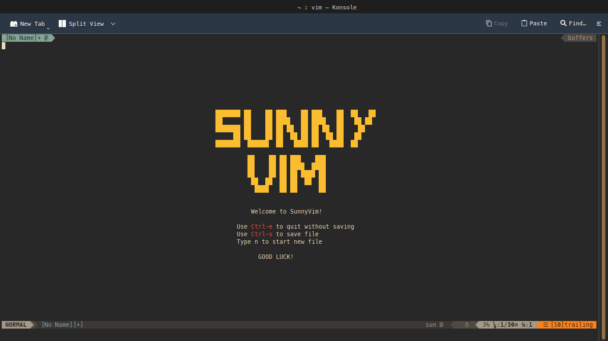
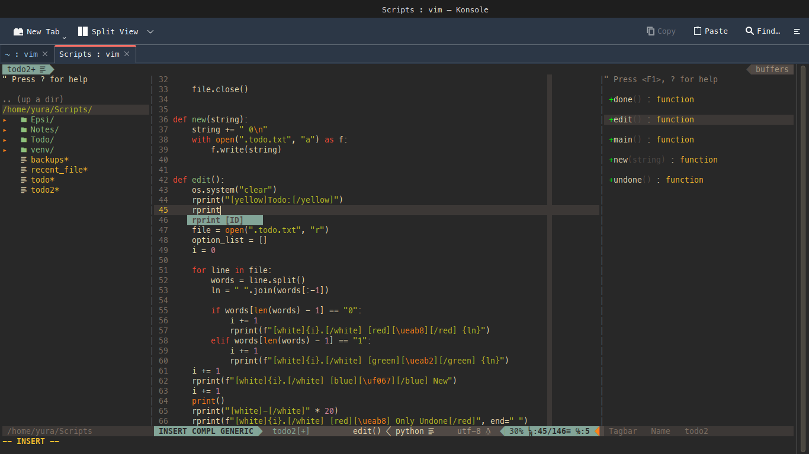
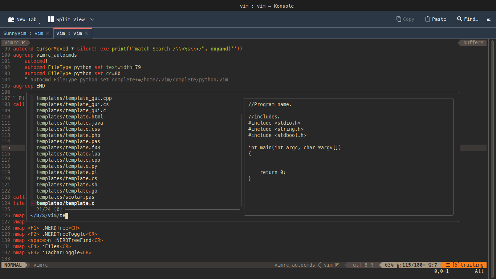

# SunnyVim

My own vim configuration

## Welcome to SunnyVim

Sunny vim is fast and easy in use vim configuration. It transform your vim to IDE with autocomplete, file exprorer, cool gruvbox theme and another features.

## Installation

To install SunnyVim you need to have vim.
To check this open your terminal and type:
`vim --version`
If you get vim's version, do next steps.
Else you need to go to this site: [vim official site](https://www.vim.org/download.php)

After you install vim write following commands in your terminal:

If you already have .vim directory, do a backup:
    `mv ~/.vim/ ~/.vim_backup/`

After this, create new .vim directory:
    `mkdir ~/.vim`

Now, install VimPlug - vim plugin manager:
    `curl -fLo ~/.vim/autoload/plug.vim --create-dirs \
    https://raw.githubusercontent.com/junegunn/vim-plug/master/plug.vim`

Also, for correctly working of autocompletion, check this website: [youcompleteme site](https://github.com/ycm-core/YouCompleteMe) or remove it from vimrc later.

Finally, you can download and extract SunnyVim:
    `git clone https://github.com/YuraSamoylov/SunnyVim.git`
    `cp SunnyVim/vim/* ~/.vim`

Enjoy!

## Usage

SunnyVim support mouse, so you can move or change splits sizes or do something else using your mouse. Also it has autocompletion for all types of brackets.

### Basic Keymaps

SunnyVim supports standart vim keymappings. But also it keep some other maps:

- Type `jj`, `jk`, `jh` in **insert** mode to *esc*.
- Type `mv` in **normal** mode to *make view*.
- Type `lv` in **normal** mode to *load view*.
- Type `Ctrl-a` to *make replace* in **all modes**.
- Type `Ctrl-s` to *save* file if it has name. You can use this in **insert** and **normal** modes.
- Type `Ctrl-q` to *save and quit* file if it has name. You can use this in **insert** and **normal** modes.
- Type `Ctrl-e` to *quit without saving* file if it has name. You can use this in **normal** mode.
- Type `q` to *quit without saving* file if it has name. You can use this in **normal** mode.

### Tabs and Splits

- Type `tn` in **normal** mode to *create a new tab*.
- Type `tj`, `tk`, `th`, `tl` in **normal** mode to *move between tabs*.
- Also type `Ctrl-k`, `Ctrl-j`, `Ctrl-h`, `Ctrl-l` in **normal** and **insert** modes to *move between tabs*.
- Type `vs` in **normal** mode to *create a vertical split*.
- Type `sp` in **normal** mode to *create a horizontal split*.
- To *move between splits* use your mouse. 

### Others

All next maps are in **normal** mode.

- Press `F1` to *open/close file manager* and `F2` *to find your file in it*
- Press `F3` to *open tagbar of your code*. Repeat *to close*.
- Press `F4` to *open fzf file explorer*. `Ctrl-q` *to close*.
- Type `space-n` to *find your file in file manager*.
- Type `Ctrl-c` to *comment line*. In **visual** mode it *comments selection*.
- Press `F5` to *spell* if you have a language pack. Also avaliable in **insert** mode.
- Press `F6` to *hide or show* cursor column. Also avaliable in **insert** mode.
- Press `F8` to *hide or show* relative numbers. Also avaliable in **insert** mode.
- Press `F9` to *hide or show* absolute numbers. Also avaliable in **insert** mode.
- Type `py` to activate the python template.
- Type `cpp` to activate the c++ template.
- Type `cl` to activate the c template.
- Type `cm` to activate the c# template.
- Type `ht` to activate the html template.
- Type `cs` to activate the css template.

I hope, you will like SunnyVim! 
